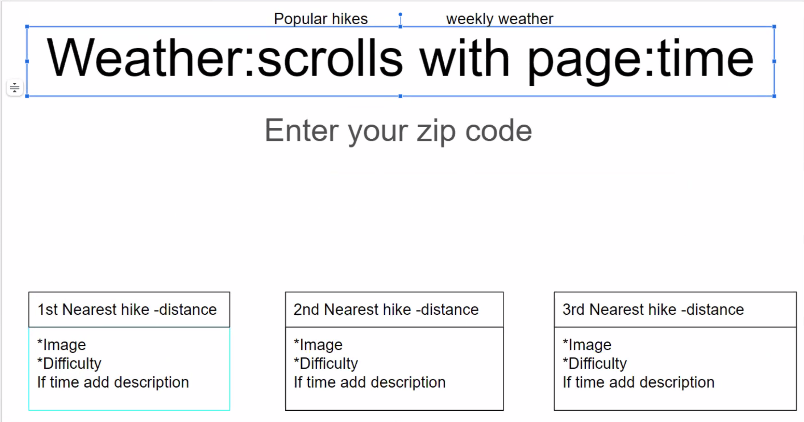

# Trail Finder App with Local Weather

## Project Description

With this project we are looking to build a functional and responsive web application that will allow the user to input a location and search local hiking trails and the upcoming weather.

## User Story

AS AN avid hiker
I WANT to search hiking trails and be able to see the local weather
SO THAT I don't encounter inclement weather while hiking

## Wireframe Image

## Planned APIs to be Used

- Hiker API by Postman
- WeatherAPI by weatherapi.com

## CSS Framework

- Tailwind CSS

## Tasks

**Alex Lara**

- HTML Structure
- User Interface/Experience

**Tiffany O'Brien**

- Tailwind CSS
- User Interface/Experience

**Aaron Woods**

- Hiker API implementation
- JavaScript Functionality

**John Bigley**

- WeatherAPI implementation
- JavaScript Functionality
