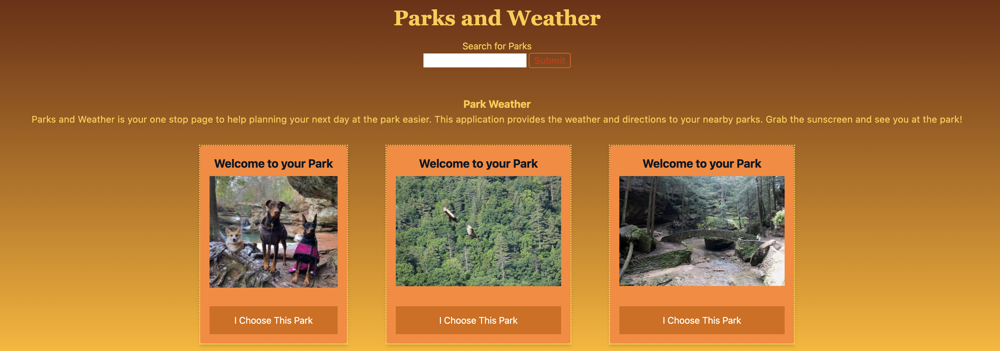

# Trail Finder App with Local Weather

## Project Description

With this project we are looking to build a functional and responsive web application that will allow the user to input a location and search local national parks and the upcoming weather.

## User Story

AS AN avid hiker
I WANT to search hiking trails and be able to see the local weather
SO THAT I don't encounter inclement weather while hiking

## Image of Page

## Planned APIs to be Used

- National Park Service API
- OpenWeather API

## CSS Framework

- Tailwind CSS

## Tasks

**Alex Lara**

- HTML Structure
- User Interface/Experience

**Tiffany O'Brien**

- Tailwind CSS
- User Interface/Experience

**Aaron Woods**

- NPS API implementation
- JavaScript Functionality

**John Bigley**

- OpenWeather API implementation
- JavaScript Functionality

## Link to Website

https://jpbigley.github.io/parks-weather-app/
